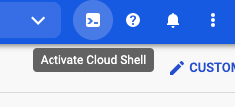

# Docker

Hi all!  These are the files that you will require to complete the exercises in the course.

Topics covered:

- Becoming familiar with the Docker CLI
- How to work with volumes and containers
- Port forwarding
- Environment variables
- Effective structuring of a Dockerfile
- The joys of using Docker Compose
- Some tips for using Docker in a Github workflow

The setup requirements are as follows:

- a running instance of Docker, installation instructions [here](https://docs.docker.com/get-docker/)
- a code editor like VS Code or IntelliJ
- git (for cloning the exercise code)

Setting up Docker can sometimes be a challenge due to resource limitations or security requirements.  A great alternative is Google Cloud Shell which provides a cloud version of VS Code with access to Docker.

### Google Cloud Shell

1. You'll need a Google account

2. Go to https://console.cloud.google.com

3. Select "Activate Cloud Shell"

   

4. Select Open editor

   

5. Select Open in New Window

   

> Note: If your browser uses cookie blockers like UBlock origin you may need to disable these to get this working

